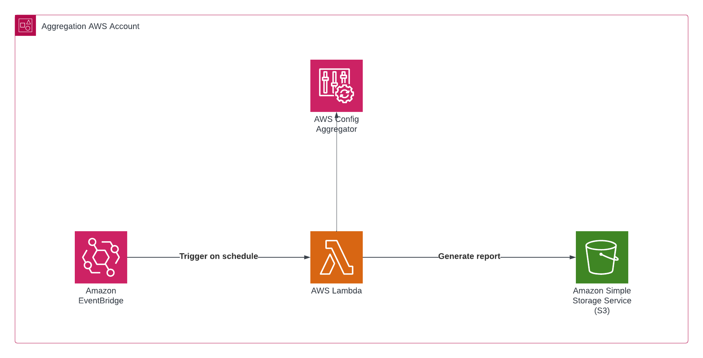

# Public resource scanner with AWS Config

## Introduction

In AWS, ensuring the security of your cloud resources is paramount. Regular scanning to discover vulnerabilities helps maintain the integrity of your cloud resources.
This repository offers an automated, serverless solution for identifying public resources in multi-account environments.
By scanning continuously, you can proactively address security risks, enhance compliance, and protect your AWS assets from potential threats.

## Solution

At the core of this solution is AWS Config, a powerful tool that allows you to assess and audit the configurations of your AWS resources.
It offers advanced query capabilities for accessing current resource state metadata across multiple accounts and regions.
You can perform property-based queries and aggregations using a subset of SQL SELECT syntax.
Best of all, AWS Config's advanced query feature is available at no extra cost in most AWS Regions.

The entire solution mechanism consists of an event that on a schedule triggers an AWS Lambda function.
This Lambda function queries the Aggregator for each of the possible public resources and arranges the data into a csv file.

The file structure is:

- accountId
- resourceId
- resourceType
- endpoint/DnsName/PublicIp

Once the file is generated it is sent to an Amazon S3 bucket.

## Deploy

The solution is implemented through Infrastructure as Code (IaC) using AWS CDK in Python.
To get started, you'll need to provide a few key parameters:

- the aggregator's name `aggregator`
- the name of the destination bucket for storing generated public reports `reportsbucket`
- the name of your 'pre-existing' bucket for centralized log storage `accessbucket`

`cdk deploy PublicResScannerStack --parameters aggregator=<AGGREGATOR_NAME> --parameters reportsbucket=<REPORTS_BUCKET_NAME> --parameters accessbucket=<ACCESS_LOGS_BUCKET_NAME>`

## Future improvements

As future enhancements, `AWS::EC2::NetworkInterface` scanning and policy scanning will be added.

If you have any suggestions for adding more resources, feel free to give them here!
